# Linux基础实验报告

## 实验问题

- 调查并记录实验环境的如下信息：
  - 当前Linux发行版基本信息
  - 当前Linux内核版本信息
- Virtualbox安装完Ubuntu之后新添加的网卡如何实现系统开机自动启用和自动获取IP？
- 如何使用`scp`在虚拟机和宿主机之间、本机和远程Linux系统之间传输文件？
- 如何配置SSH免密登录？

## 问题解决记录

### 调查并记录实验环境的Linux发行版与内核版本信息

课上反复强调的`lsb_release -a`可以查看发行版信息，分别在虚拟机和实验平台进行测试，截图如下。

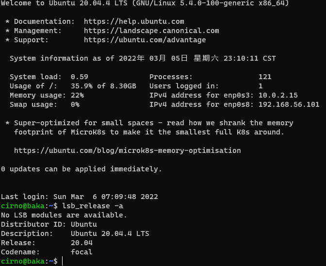

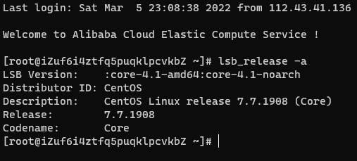

内核信息则是用`uname -a`就可以获得返回的内核信息，同样是两份截图。

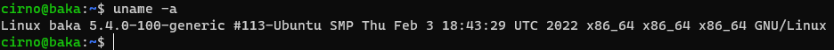

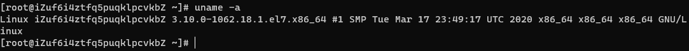

### Virtualbox安装完Ubuntu后添加网卡的开机自动启用与IP获取

简单来说就是DHCP吧，讲道理安装之前如果就添加了第二张Host-Only的网卡其实就不需要手动配置了...

简单查一下Ubuntu的网络管理用了`netplan`工具，配置文件是默认放在`/etc/netplan/`的`*.yaml`，我这里看到的是`00-installer-config.yaml`，用习惯的`nano`编辑一下内容：

```bash
sudo nano /etc/netplan/00-installer-config.yaml
```

输入密码后找到执行`ip a`之后找到的第二张网卡ID`enp0s8`，对应条目下添加DHCP，内容记录如下图：

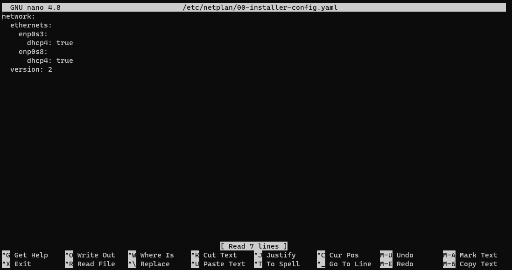

`Ctrl`+`S`保存退出后执行

```bash
sudo netplan apply
```

执行后没有回显，重启后发现已经可以自动获取IP，于是便可以按照老师那样内网连接SSH了。

### 使用`scp`在虚拟机与宿主机、本地和远程Linxu系统之间传输文件

首先`scp`是基于SSH连接的，由于写报告时已经完成了宿主机SSH连接虚拟机，了解了用法之后直接切换到宿主机下载目录尝试传了目录下的一张图片到虚拟机用户目录下临时创建的`~/temp/`文件夹，操作如下：

```PowerShell
scp .\600px-Vigenère_square.svg.png cirno@192.168.56.101:~/temp/
```

然后是执行回显与执行前后在虚拟机内对`~/temp/`文件夹内容的对比查看截图：

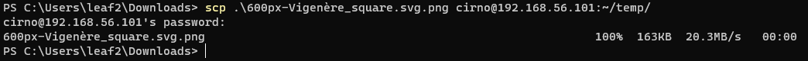

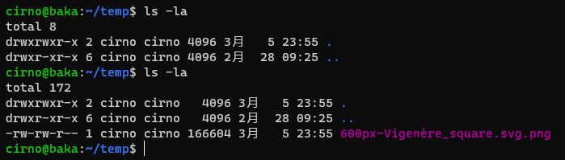

远程Linux系统这边为了保证可以进行文件传输挑了阿里云Linux文件与权限的实验平台，同样是SSH远程连接后先创建了`~/temp/`，同样是把向虚拟机传的那张图片传到实验平台上，操作如下：

```PowerShell
scp .\600px-Vigenère_square.svg.png root@101.133.140.86:~/temp/
```

执行回显与实验平台的目录内容对比查看截图如下：

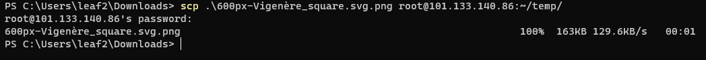

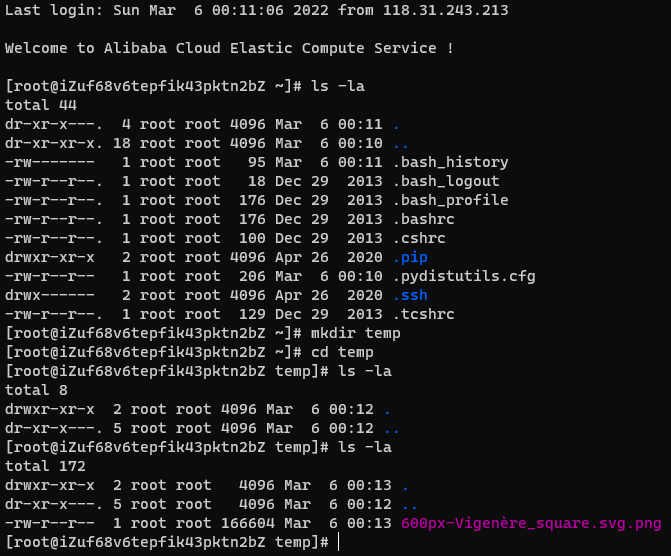

### 配置SSH免密登录

>2022/3/7 Update  
Windows端PowerShell使用`type`配合`ssh`与`cat`把`id_rsa.pub`保存在`~/.ssh/authorized_keys`后就可以实现免密登录了，操作与截图如下：  

```PowerShell
type C:\Users\leaf2\.ssh\id_rsa.pub | ssh cirno@192.168.56.101 "cat >> ~/.ssh/authorized_keys"
```

>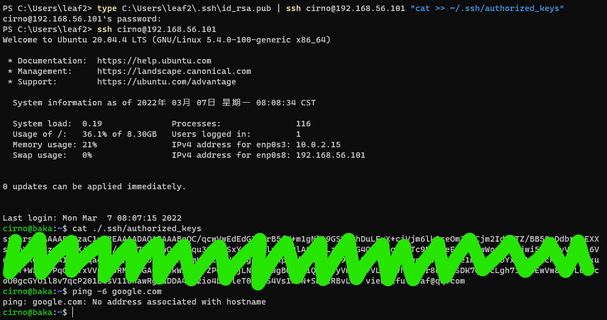

简单的资料查找之后，了解到其实是使用`ssh-copy-id`这个工具，原理是把本地的公钥放到远程系统`~/.ssh`目录下，对应ID会被存入SSH的authorized_keys里面，理论存在，实践开始。

“显然一次性的实验平台上做这个没意义，打算在虚拟机和宿主机之间试试”，最开始是这么想的，没想到可爱的Windows没有`ssh-copy-id`这个工具，网上倒是有很多自己写的函数以实现同样功能，于是嫌麻烦的我决定用虚拟机免密登录一下阿里云的实验平台。

执行操作首先是密钥生成，第一次SSH连接都需要的操作：

```bash
ssh-keygen
```

回显如下：

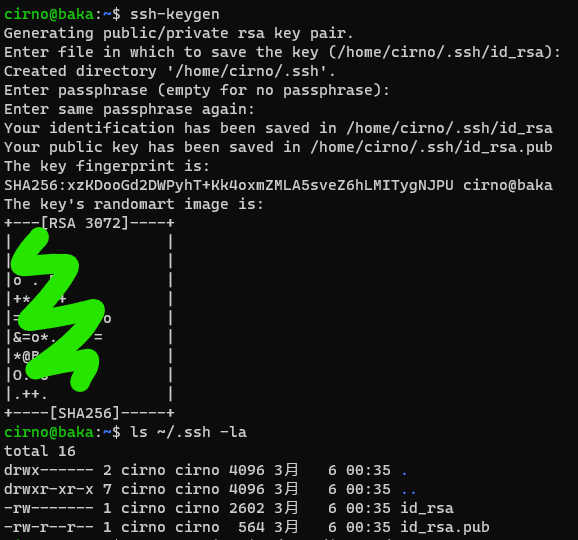

一路缺省值生成完毕后，使用`ssh-copy-id`工具，执行：

```bash
ssh-copy-id -i ~/.ssh/id_rsa/pub root@101.133.140.86
```

类似于前面的SSH连接或是`scp`文件传输，身份验证后就提示可以直接免密登录了，回显如下：

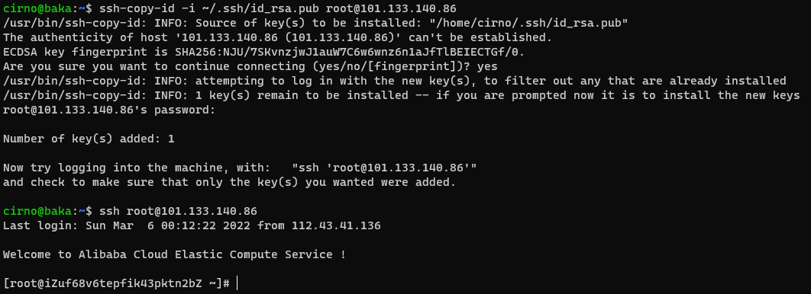

## 总结与整理

遇到的问题或者踩的坑就在这里总结吧。

### 一些趣事

- 安装完Ubuntu之后其实只配了一个网卡，在添加第二张网卡之前我是通过Virtualbox自带的网卡端口转发实现的宿主机SSH连接，把虚拟机的22端口转到宿主机这边的自定义端口，然后只需要额外加一个`-p`参数就可以通过local host连接到虚拟机，其实也还不错。
- 关于获取Linux的信息，我个人是一直用`neofetch`这个工具，简单一个指令，可以给你更详细的关于系统的软硬件信息，甚至有终端渲染的发行版图标，当然你还可以自己自定义让它渲染你想要的图片，不过唯一的缺点就是一般的发行版很少自带这个工具，需要手动安装，但是近乎全部的发行版却口嫌体正直地把这个工具收录在了系统自带的软件源里。

### 一些踩坑

- `*.yaml`格式文件好像有很严格的格式要求，多一个或者少一个空格都是不行的，这导致我配置`netplan`的时候无数次报错说配置文件有问题，最后还是按照Ubuntu官网有一个配置`netplan`里面说到用2个空格进行缩进，老老实实删掉了多余的空格和空行才成功`sudo netplan apply`。
- 关于Virtualbox虚拟机，虚拟化接口选择错误可能直接导致虚拟器不能启动，对应关系也只是Linux对应KVM，Windows当然是推荐用Hyper-V，但是似乎也可以兼容KVM，这一点需要注意，另外如果电脑磁盘够大的话建议一次性分配完整磁盘，动态分配其实很影响虚拟机性能。

## 参考链接

- [Install second network interface on virtualized Ubuntu Server](https://askubuntu.com/questions/778392/install-second-network-interface-on-virtualized-ubuntu-server)
- [How to Use SCP Command to Securely Transfer Files](https://linuxize.com/post/how-to-use-scp-command-to-securely-transfer-files/)
- [SSH 三步解决免密登录](https://blog.csdn.net/jeikerxiao/article/details/84105529)
- [Windows 10 OpenSSH Equivalent of ssh-copy-id](https://www.chrisjhart.com/Windows-10-ssh-copy-id/)
