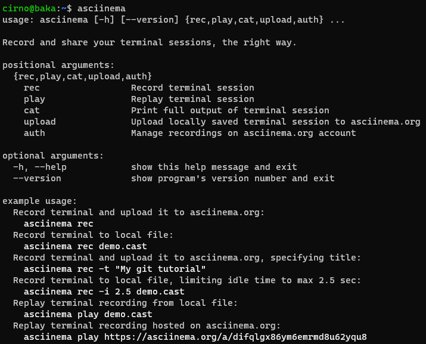

# 实验报告

## 实验问题

- 使用表格方式记录至少2个不同Linux发行版本上以下信息的获取方法，使用[asciinema](https://asciinema.org/)录屏方式**分段**记录相关信息的获取过程和结果
  - 【软件包管理】在目标发行版上安装`tmux`和`tshark`；查看这2个软件被安装到哪些路径；卸载`tshark`；验证`tshark`卸载结果
  - 【文件管理】复制以下`shell`代码到终端运行，在目标Linux发行版系统中构造测试数据集，然后回答以下问题：
    - 找到`/tmp`目录及其所有子目录下，文件名包含`666`的所有文件
    - 找到`/tmp`目录及其所有子目录下，文件内容包含`666`的所有文件

  ```bash
  cd /tmp && for i in $(seq 0 1024);do dir="test-$RANDOM";mkdir "$dir";echo "$RANDOM" > "$dir/$dir-$RANDOM";done
  ```

  - 【文件压缩与解压缩】练习课件中[文件压缩与解压缩](https://c4pr1c3.github.io/LinuxSysAdmin/chap0x02.md.html#/12/1)一节所有提到的压缩与解压缩命令的使用方法
  - 【跟练】[子进程管理实验](https://asciinema.org/a/f3ux5ogwbxwo2q0wxxd0hmn54)
  - 【硬件信息获取】目标系统的CPU、内存大小、硬盘数量与硬盘容量

## 问题解决记录

### 配置`asciinema`

总之按照官方文档来配置是不会出问题的。Ubuntu这边用：

```bash
sudo apt update && sudo apt upgrade -y && sudo apt install asciinema -y
```

习惯性顺手升级了，不知道这种喜欢up to date是好还是不好，安装完成可以正常使用，截图如下：



按照文档指引，使用`asciinema auth`进行在线账号绑定，关联完成后小测试一下，安装一下`sl`跑个火车看看：

[](https://asciinema.org/a/476517 "居然有markdown适配，虽然也只是个截图吧，总比只能放链接强")

看样子问题不大，云平台那边完全相同的过程就不记录了，无非是换用`yum`来安装，包管理器级别差别，总之进入下一步。

## 总结与整理

遇到的问题或者踩的坑就在这里总结吧。

### 一些趣事

### 一些踩坑

## 参考链接

[asciinema Docs](https://asciinema.org/docs/getting-started)
