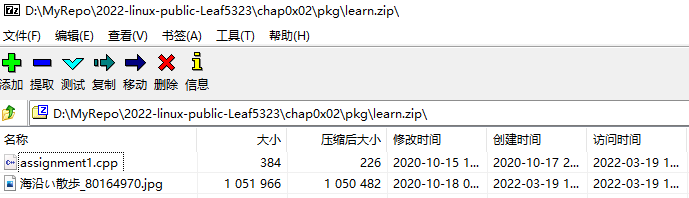

# 实验报告

## 实验问题

- 使用表格方式记录至少2个不同Linux发行版本上以下信息的获取方法，使用[asciinema](https://asciinema.org/)录屏方式**分段**记录相关信息的获取过程和结果
  - 【软件包管理】在目标发行版上安装`tmux`和`tshark`；查看这2个软件被安装到哪些路径；卸载`tshark`；验证`tshark`卸载结果
  - 【文件管理】复制以下`shell`代码到终端运行，在目标Linux发行版系统中构造测试数据集，然后回答以下问题：
    - 找到`/tmp`目录及其所有子目录下，文件名包含`666`的所有文件
    - 找到`/tmp`目录及其所有子目录下，文件内容包含`666`的所有文件

  ```bash
  cd /tmp && for i in $(seq 0 1024);do dir="test-$RANDOM";mkdir "$dir";echo "$RANDOM" > "$dir/$dir-$RANDOM";done
  ```

  - 【文件压缩与解压缩】练习课件中[文件压缩与解压缩](https://c4pr1c3.github.io/LinuxSysAdmin/chap0x02.md.html#/12/1)一节所有提到的压缩与解压缩命令的使用方法
  - 【跟练】[子进程管理实验](https://asciinema.org/a/f3ux5ogwbxwo2q0wxxd0hmn54)
  - 【硬件信息获取】目标系统的CPU、内存大小、硬盘数量与硬盘容量

## 问题解决记录

### 配置asciinema

总之按照官方文档来配置是不会出问题的。Ubuntu这边用：

```bash
sudo apt update && sudo apt upgrade -y && sudo apt install asciinema -y
```

习惯性顺手升级了，不知道这种喜欢up to date是好还是不好，安装完成可以正常使用，截图如下：


按照文档指引，使用`asciinema auth`进行在线账号绑定，关联完成后小测试一下，安装一下`sl`跑个火车看看：

[](https://asciinema.org/a/476517 "居然有markdown适配，虽然也只是个截图吧，总比只能放链接强")

看样子问题不大，云平台那边完全相同的过程就不记录了，无非是换用`yum`来安装，包管理器级别差别，总之进入下一步。

### 软件包管理

按照要求，安装`tmux`和`tshark`，Ubuntu这边用:

```bash
sudo apt install tmux tshark
```

结果如下：

[](https://asciinema.org/a/477228)

云主机的CentOS因为直接是root用户所以直接用：

```bash
yum install tmux tshark
```

遇到一点问题就是软件源内没有`tshark`(其实就是包`wireshark`，假装不知道)，所以只完成了`tmux`的安装：

[](https://asciinema.org/a/477250)

查找两个软件的安装位置也是因发行版而异，Ubuntu基于Debian自然是`dpkg`，这边分别用:

```bash
dpkg --listfiles tmux
dpkg --listfiles tshark
```

效果是这样的：

[](https://asciinema.org/a/478006)

阿里云实验平台的CentOS则是用`rpm`，也就是缩写的“RedHat Package Manager”，命令略有不同：

```bash
#由于只有tmux被安装了，于是只记录执行有关tmux的命令
rpm -ql tmux
```

效果和`dpkg`是类似的：

[](https://asciinema.org/a/478009)

另外还有一个和不太一样的通用办法，就是用`which`来查找`$PATH`里面存放的默认可执行程序路径，效果就不额外录制了。

由于`tshark`没有在实验平台上安装所以默认只在Ubuntu的虚拟机里操作，用有“超级牛力”的`apt`进行卸载，卸载后重复上面的`dpkg`查找与`tshark`有关的包内容以验证卸载情况：

```bash
sudo apt remove tshark -y
dpkg --listfiles tshark
```

执行效果如下：

[](https://asciinema.org/a/478010)

### 文件管理

首先执行完要求的指令，然后先是查找`/tmp`及其子目录内所有文件名包含666的文件，使用：

```bash
#-type f意思是仅考虑files，*放在666两端用来通配，表示无论前后内容而只要包含666
#用sudo是因为刚好/tmp目录下有root用户文件，避开不必要的权限修改
sudo find . -type f -name '*666*'
```

查找`/tmp`及其子目录，文件内容包含666的文件，这里遇到点问题，不知道是运气问题还是什么，没有随机生成一个内容包含666的文件，包含66的倒是有，使用如下命令：

```bash
#-r也可以写成--recursive即进行递归查找
#借鉴了徐岩同学的排除*.cast内容防止asciinema录屏出现乱码
sudo grep -r --exclude=*.cast '666' .
sudo grep -r --exclude=*.cast '66' .
```

两个操作录制在一起了，包括没有生成含有666内容的文件于是再次查找了内容包含66的文件的操作，效果如下：

[](https://asciinema.org/a/478281)

### 文件压缩与解压缩

由于原则上类Unix只要用一样的工具包操作步骤都是一样的，默认使用Ubuntu的虚拟机进行操作

需要学习的工具有`gzip`、`bzip2`、`zip`、`tar`、`7z`和`rar`，首先在宿主机准备好需要用的压缩包，用Windows这边7-Zip支持压缩的格式打包压缩，压缩包内容如下所示：



使用`scp`把准备的压缩包传入虚拟机，另外Ubuntu需要用户安装`zip`和`p7zip`，不属于出厂自带。

```PowerShell
#压缩包在cd到的目录，并且目前只有zip、tar和7z格式
cd D:\MyRepo\2022-linux-public-Leaf5323\chap0x02\pkg\
scp .\learn.7z .\learn.tar .\learn.zip cirno@192.168.56.101:~/temp/
```

对于`learn.zip`要用`zip`包内的`unzip`命令：

```bash
#为了方便区分，选择解压到./zip文件夹内
unzip -d ./zip learn.zip
```

对于`learn.tar`则是用`tar`工具相关命令：

```bash
#同解压zip，这次解压到./tar内
#目前是手动添加了./tar目录，因为好像不能直接解压到不一样名字的目录
mkdir ./tar
#-x等于--extract，-f等于--file=，GNU style
tar -xf learn.tar -C ./tar
```

`learn.7z`这边用`p7zip`包内的`7z`相关命令：

```bash
#解压到./7z目录不用解释了
#e代表extract，-o{需要解压到的目录，格式好怪}
#另外使用7z x可以直接解压到压缩包所在目录
7z e learn.7z -o./7z
```

下面是~~集大成~~三种解压操作的录像：

[](https://asciinema.org/a/478381)

然后是压缩，准备把三个learn的压缩包分别再压缩成没尝试过的格式，比如`gz`和`bzip`格式：

```bash
#gzip本身没有合并打包的功能，所以这里直接用tar打包成gz，GitHub源码最喜欢的打包压缩方式
#tar中-c即--create，-v即--verbose详细过程，-z直接生成.tar.gz格式文件
tar -czvf compress.tar learn.*
#然后tar集大成可以直接打包成bz2，把-z换成-j表示使用bzip2
tar -cjvf compress.tar learn.*
```

由于用了verbose所以就不进行解压了，操作录像如下：

[](https://asciinema.org/a/478390)

### 跟练子进程管理

看了操作的录屏和课件，云里雾里姑且不去深究回显相关的操作，大概去了解了一下关于`Ctrl`+`Z`，意思是暂停当前的进程，与之配套使用的命令是`fg`、`bg`和`jobs`。

首先`jobs`可以以列表的形式显示被`&`放在后台执行的进程并记录序号，`fg`用于把需要的后台进程拿到前台，也就是foreground，`bg`则是把进程放在后台，同理就是background，`fg`和`bg`都可以后接`jobs`里面列表中进程的序号来指定前台放置哪一个进程，或者是后台继续执行哪一个进程。

然后说到`Ctrl`+`Z`，下面还是简称`^Z`好了。说白了就是允许你把某个`&`了的进程`fg`出来的时候暂停这个进程，因为正常情况下`fg`出来的程序是不接受输入的，所以我们用`^Z`暂停执行前台这个占用输入的进程，终端恢复可以输入的状态，这时候如果使用`jobs`来查看后台进程其实可以看到Stopped状态的提示，如果需要再后台运行那个被暂停的进程，使用`bg`选择那个进程就行了，这时使用`jobs`查看可以看到进程又恢复了Running状态。

然后关于`kill`，本身有很多被称作SIG的信号，使用`kill -L`可以看到一个带有序号的表格，所以也就明白了使用`kill -9`其实是发送第9个SIG也就是SIGKILL后接进程ID，到这里也就差不多了，`ps`目前当作已知使用，后面再慢慢研究。

最后是如下的操作录像：

[](https://asciinema.org/a/478418)

### 硬件信息获取

首先是CPU信息，使用`lscpu`可以获得详尽的内容，但是一般了解一下名称、核心数、线程数什么的就够了，所以用一下`grep -E`进行扩展筛选信息，命令如下：

```bash
#当然也可以写成egrep，一般也是egrep会简单一点吧（笑）
lscpu|grep -E 'CPU|Model|Thread'
```

“内存大小用`/proc/meminfo`可以查看”，本来想这么写的，结果随便想试一下能不能`lsmem`，然后发现这个好像更直白一点，就用这个了：

```bash
lsmem
#查看/proc/meminfo的办法也加上，这次用egrep筛选好吧，一般总共大小和可用大小就够了吧
cat /proc/meminfo|egrep 'Total|Available'
```

关于硬盘数量和大小，一个`lsblk`就🆗了，操作如下：

```bash
lsblk
```

下面是操作录像：

[](https://asciinema.org/a/478430)

## 总结与整理

遇到的问题或者踩的坑就在这里总结吧。

### 一些趣事

- 这个实验报告没有名字，嗯因为老师那边的[课件](https://github.com/c4pr1c3/LinuxSysAdmin/blob/master/chap0x02.exp.md)就没有名字，本来想叫无名的实验报告的，有点奇怪就算了。

- 这个实验报告越写越像是博客了，我真的没办法，想慢点写拉长战线导致差点晚提交一个星期...但是却找不到博客的氛围，不知道是不是因为是作业的性质导致完全没有兴趣学下去。

- 讲道理，关于Linux发行版的理解，直到现在我还是认为优化什么的都是玄学，比如说RedHat系更适合服务器使用，或者是像虚拟机用的Ubuntu Server，反倒是根据包管理器进行划分是不是更明晰一些，比如说Ubuntu等Debian系都用了超级牛力`apt`和`dpkg`，CentOS那边清一色的`yum`和`rpm`，我自己用的Arch用`pacman`，之前还用过的Fedora用的`dnf`，openSUSE用了`zypper`等，而且更多的发行版都是基于某个大的发行版的定制，有了各种各样的flavor，一般都是折腾DE和GUI就是了，CLI直接用也是服务器云主机才这么干，一般多少也有个lxde或者是lxqt的轻量级DE才对，当然用openbox的就不知道了，未涉足的领域（笑）

### 一些踩坑

- 不要期望可以从同学的实验报告中学到多少，欲速则不达，有些学习真的需要花时间，而且是大块的时间，老老实实看man的解释或者Google比偷懒好。

## 参考链接

[asciinema Docs](https://asciinema.org/docs/getting-started)

[How to find the installation path for a software under linux?](https://unix.stackexchange.com/questions/19369/how-to-find-the-installation-path-for-a-software-under-linux)

[Grep Command in Linux (Find Text in Files)](https://linuxize.com/post/how-to-use-grep-command-to-search-files-in-linux/)

[2022-linux-public-Xuyan-cmd/chap0×02/chap0×02.md](https://github.com/CUCCS/2022-linux-public-Xuyan-cmd/blob/chap0%C3%9702/chap0%C3%9702/chap0%C3%9702.md)

[How to Exclude in Grep](https://linuxize.com/post/grep-exclude/)

[How to choose directory name during untarring](https://unix.stackexchange.com/questions/11018/how-to-choose-directory-name-during-untarring)

[Extract folder content from 7z archive to specific folder](https://superuser.com/questions/1366616/extract-folder-content-from-7z-archive-to-specific-folder)

[Archive under Linux (tar, gz, bz2, zip)](https://www.thomas-krenn.com/en/wiki/Archive_under_Linux_(tar,_gz,_bz2,_zip))

[Linux control sequence tricks](https://www.networkworld.com/article/3284105/linux-control-sequence-tricks.html)

[How to check how many CPUs are there in Linux system](https://www.cyberciti.biz/faq/check-how-many-cpus-are-there-in-linux-system/)

[How To List Disks on Linux](https://devconnected.com/how-to-list-disks-on-linux/)
