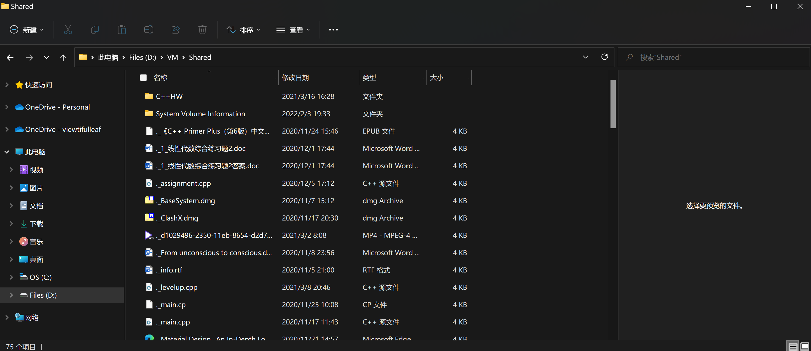

# Linux服务器系统管理基础实验报告

## 实验环境

||Host|VM|
|:----:|:----:|:----:|
|OS|Windows11 22H2 22581.200|Ubuntu 20.04.4 LTS x86_64|
|User|leaf2|cirno|

## 实验问题

- 如何添加一个用户并使其具备sudo执行程序的权限？

- 如何将一个用户添加到一个用户组？

- 如何查看当前系统的分区表和文件系统详细信息？

- 如何实现开机自动挂载Virtualbox的共享目录分区？

- 基于LVM（逻辑分卷管理）的分区如何实现动态扩容和缩减容量？

- 如何通过systemd设置实现在网络连通时运行一个指定脚本，在网络断开时运行另一个脚本？

- 如何通过systemd设置实现一个脚本在任何情况下被杀死后会立即重新启动？实现杀不死？

## 问题解决记录

### 添加一个用户并使其具备sudo执行程序的权限

和我之前自己装Arch的配置不一样，用`visudo`查看`/etc/sudoers`发现就只有admin和sudo两个用户组，而且查阅资料得知admin组也是Ubuntu12.04前的历史遗留问题了。可以用我知道的`useradd`来实现添加新用户并直接分配到sudo组内，进行测试：

```bash
#首先添加testUser
sudo useradd -G sudo testUser
#给testUser设置密码
sudo passwd testUser
#用套娃方式确认新建用户的sudo权限
sudo -u testUser sudo neofetch
```

操作录像如下：

[](https://asciinema.org/a/483758)

### 将一个用户添加到一个用户组

这里可以用完全就是拼写顺序不一样的`adduser`来实现把已有用户添加到某个用户组，因为前面创建的testUser只分配了sudo组，现在尝试把testUser放到当前用户cirno的cirno组内：

```bash
#使用id与grep确认testUser现有组
id testUser|grep cirno
#将testUser放到admin组
sudo adduser testUser cirno
#再次使用id与grep确认testUser是否在admin组
id testUser|grep cirno
```

操作录像如下：

[](https://asciinema.org/a/483789)

### 查看当前系统的分区表和文件系统详细信息

因为装Arch学会用的是`fdisk`，但是现在又说`fdisk`不能给2TB大小以上的硬盘分区于是需要用`gdisk`，学习了一下发现至少一些操作逻辑上还是和`fdisk`很不一样，明明还叫GPT fdisk来着...需要完成的操作如下：

```bash
#gdisk需要明确-l之后的设备而不是像fdisk一样直接列出所有设备，所以先lsblk找到硬盘设备
lsblk
#找到sda之后用gdisk查看分区表
sudo gdisk -l /dev/sda
#当然也可以直接gdisk进入编辑模式后使用p来列出分区表
sudo gdisk /dev/sda
#因为gdisk搞不明白为什么一定要用编号来表示文件系统，所以文件系统详细信息还是用fdisk
sudo fdisk -l /dev/sda
```

操作录像如下：

[](https://asciinema.org/a/483795)

### 实现开机自动挂载Virtualbox的共享目录分区

这里遇到的小插曲是没有装虚拟机的增强件，刚好学习了一下CLI状态下怎么手动装增强件，操作如下：

```bash
#首先创建挂载点文件夹/media/cdrom
sudo mkdir /media/cdrom
#然后在虚拟机的显示器上方工具栏的设备选单中点击安装增强功能，就可以开始挂载了
sudo mount /dev/cdrom /media/cdrom
#sudo执行/media/cdrom/VBoxLinuxAdditions.run然后等待安装完成后重启即可
#注意：这里我提前装好了build-essential，也就是编译所需的环境
sudo /media/cdrom/VBoxLinuxAdditions.run
sudo reboot
#重启后先新建挂载点文件夹~/shared/然后进行挂载，另外虚拟机共享文件夹设置中的名称为Shared
sudo mount -t vboxsf Shared ~/shared
#注：此时为临时挂载
```

关于安装的过程我没有录像，也懒得再卸载重新录制安装过程了，直接进入开机自动挂载共享目录分区的相关内容。

还是凭借装Arch的经验，编辑`/etc/fstab`就可以了，操作如下：

```bash
sudo nano /etc/fstab
#按照fstab要求的格式进行配置，添加内容为
#Shared /home/cirno/shared vboxsf defaults 0 0
#之后编辑/etc/modules添加vboxsf后保存
sudo nano /etc/modules
#重启系统
sudo reboot
```

操作录像如下，重启过程无法录制于是跳过了：

[](https://asciinema.org/a/483810)

重启后的演示录像：

[](https://asciinema.org/a/483811)

另外附上在宿主机内对于共享文件夹内容的截图：



### 基于LVM的分区实现动态扩容和缩减容量

~~总之先创建快照，毕竟要折腾分区~~

因为各种VirtualBox的奇怪快照逻辑，最后决定小心一点，不用快照了...

关机添加硬盘，新建两块虚拟盘，分别为32G大小，开机进行分区：

```bash
#下面的操作基本上都要root用户权限所以直接切换为root用户进行操作
su
#lsblk查看新添加的硬盘之后使用fdisk进行分区
lkblk
fdisk /dev/sdb
#使用g创建新GPT分区表，n创建新分区，设置为8+8+16G的3个分区
fdisk /dev/sdc
#同理，这次换为12+12+8G3个分区，之后统一进行格式化
mkfs.ext4 /dev/sdb1
mkfs.ext4 /dev/sdb2
mkfs.ext4 /dev/sdb3
mkfs.ext4 /dev/sdc1
mkfs.ext4 /dev/sdc2
mkfs.ext4 /dev/sdc3
```

为了录制方便，先录制以上分区与格式化操作：

[](https://asciinema.org/a/483853)

接下来进行LVM的相关配置，按照标准的LVM结构首先需要创建PV，然后对PV分组成为VG，再在VG上划分LV，操作如下：

```bash
#为了操作方便仍然使用root用户
su
#使用pvcreate进行物理分卷的创建
pvcreate /dev/sdb{1,2,3} -y
pvcreate /dev/sdc{1,2,3} -y
#使用vgcreate进行物理卷组的创建
#为了体现逻辑分组设置了很离谱的分组
vgcreate test-vg-1 /dev/sdb{1,2} /dev/sdc{2，3}
vgcreate test-vg-2 /dev/sdb3 /dev/sdc1
#之后进行LV的创建，分别定额创建与用尽容量创建以模拟容量扩充与缩减
lvcreate -L 16G -n test-lv-1 test-vg-1
lvcreate -l 100%FREE -n test-lv-2 test-vg-2
#用lsblk确认LV路径后对LV进行格式化创建文件系统
lsblk
mkfs.ext4 /dev/test-vg-1/test-lv-1
mkfs.ext4 /dev/test-vg-2/test-lv-2
#使用lvs确认块设备情况，接下来进行test-lv-1的扩容与test-lv-2的减容
lvs
lvresize --size +8G --resizefs test-vg-1/test-lv-1
lvresize --size -4G --resizefs test-vg-2/test-lv-2
#使用lvs进行容量调整的检查
lvs
```

如下是操作录像：

[](https://asciinema.org/a/483873)

### 通过systemd设置实现在网络连通与网络断开时分别运行不同的脚本

关于systemd的认识我只停留在使用Arch时偶尔需要改动服务的自启动与故障服务的排查，和这个题目相似逻辑上应该也是需要调整相关的配置文件以实现条件触发脚本启动，总之是需要彻底了解一下systemd的工作原理了。

### 通过systemd设置实现杀不死脚本

## 总结与整理

遇到的问题或者踩的坑就在这里总结吧。

### 一些趣事

- 感慨合着我之前自己学会装Arch，对于Linux的了解都是“过时的”吗？像用到的`fdisk`因为不能处理2TB以上硬盘就应该用`gdisk`或者`partd`了，说到fstab也是，忘了是课上还是在讨论区看到老师说fstab属于“老式Linux的解决办法”，小查了一下发现确实是可以用systemd来实现挂载，但是感觉就是回到了systemd的争论：关于做一件事并将其做好的Unix哲学...倒不是非要说谁对谁错，只是为这种不完全否定而心情复杂。

- reddit上有人提出了“To LVM or not to LVM, that is the question...”，这种逻辑分卷在划分时实在太需要清晰的分区规划了，但是又可以很不需要规划地随便搭配物理卷组，对于有没有必要使用LVM在个人角度其实更偏向于否定的答案，但是如果是大型的服务器可能就未必，LVM诚然提供了太多实用性很强的功能，包括这次实验内容涉及的便利的容量调整以及不涉及的备份功能等等。说起来还是只要维护的人烧脑子就好，剩下的使用者们果然还是轻松太多了啊XD

### 一些踩坑

- 虽然说过很多遍了但是，Linux务必注意区分大小写！！！虚拟机挂载共享分区目录那里自己设置的是首字母大写的Shared，但是配置过程中不知道多少次重复过程中都只写了全小写shared导致挂载失败，好在后面反应过来了（笑）

- 讲道理这一条我不知道该放在趣事还是踩坑里面，之前老老实实按照老师的叮嘱去给虚拟机创建快照备份，但是想要调整时发现不能删除快照了，报错信息中主要解释原因的一句是“has more than one child hard disk”，总之现在明白了，就是说VirtualBox的快照逻辑是对于创建时的硬盘进行复制，然后后期的操作都会进行在这个复制体上，但是我这卡到了bug，一个记录点下出现了多个attached的复制体硬盘，每一块都无法删除，最后就是上面报错信息的描述。简单理解一下，快照相当于创建分支，但是理论上应该是单链表的模式，我这卡出了树，多个子节点那种...总之是通过放弃当前的全部操作，把虚拟机存放的文件夹内的Snapshots文件夹整个先删掉，再在虚拟机设置中的储存内重新选择本体硬盘才得以解决，于是一切回归宁静，可喜可贺可喜可贺...

## 参考链接

- [How to create a new sudo user on Ubuntu Linux server](https://www.cyberciti.biz/faq/how-to-create-a-sudo-user-on-ubuntu-linux-server/)

- [如何科学高效地安装Arch](https://leaf5323.github.io/blog.github.io/install.html)

- [Mounting VirtualBox shared folders on Ubuntu Server 18.04 LTS (Bionic Beaver)](https://gist.github.com/estorgio/0c76e29c0439e683caca694f338d4003)

- [第三章：Linux服务器系统管理基础](https://github.com/c4pr1c3/LinuxSysAdmin/blob/master/chap0x03.md)
