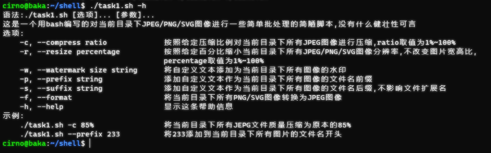
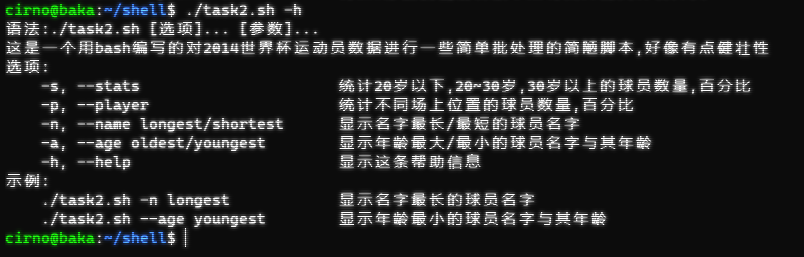
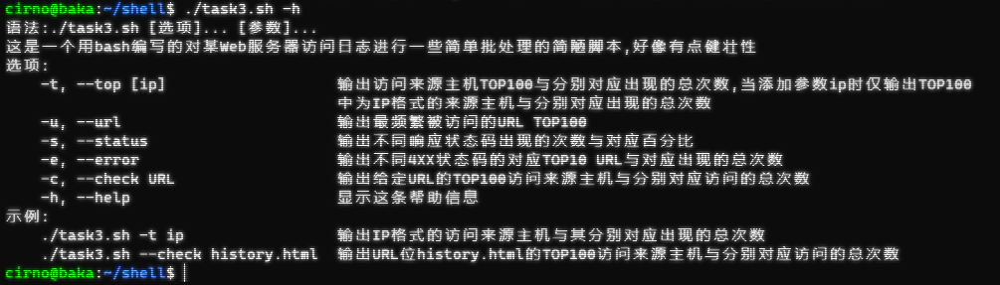

# shell脚本编程基础实验报告

## 实验环境

||Host|VM|
|:----:|:----:|:----:|
|OS|Windows11 22H2 22581.200|Ubuntu 20.04.4 LTS x86_64|
|User|leaf2|cirno|

## 实验问题

- [x] 任务一：用bash编写一个图片批处理脚本，实现以下功能：

  - [x] 支持命令行参数方式使用不同功能

  - [x] 支持对指定目录下所有支持格式的图片文件进行批处理

  - [x] 支持以下常见图片批处理功能的单独使用或组合使用

    - [x] 支持对jpeg格式图片进行图片质量压缩

    - [x] 支持对jpeg/png/svg格式图片在保持原始宽高比的前提下压缩分辨率

    - [x] 支持对图片批量添加自定义文本水印

    - [x] 支持批量重命名（统一添加文件名前缀或后缀，不影响原始文件扩展名）

    - [x] 支持将png/svg图片统一转换为jpg格式图片

- [x] 任务二：用bash编写一个文本批处理脚本，对以下附件分别进行批量处理完成相应的数据统计任务：

  - 2014世界杯运动员数据

    - [x] 统计不同年龄区间范围（20岁以下、[20-30]、30岁以上）的球员数量、百分比

    - [x] 统计不同场上位置的球员数量、百分比

    - [x] 名字最长的球员是谁？名字最短的球员是谁？

    - [x] 年龄最大的球员是谁？年龄最小的球员是谁？

- [x] 任务二：用bash编写一个文本批处理脚本，对以下附件分别进行批量处理完成相应的数据统计任务：

  - Web服务器访问日志

    - [x] 统计访问来源主机TOP 100和分别对应出现的总次数

    - [x] 统计访问来源主机TOP 100 IP和分别对应出现的总次数

    - [x] 统计最频繁被访问的URL TOP 100

    - [x] 统计不同响应状态码的出现次数和对应百分比

    - [x] 分别统计不同4XX状态码对应的TOP 10 URL和对应出现的总次数

    - [x] 给定URL输出TOP 100访问来源主机

## 问题解决记录

首先是下面这个明示了成功的绿色

👇👇👇

可以去[这里](https://app.travis-ci.com/github/CUCCS/2022-linux-public-Leaf5323)查看Travis CI的页面，里面有详细的演示过程。

此外报告内容会比较简陋，因为实在没有什么可以记录的，shellcheck已经检测了绝大多数语法错误，剩下的只不过是终端里面的跑不通或者格式调整，哪怕想要稍微写详细一点也是会有上千条错误与对应的错误内容截图，于是这里仅记录最基础的内容。

### 任务一

逻辑上，首先shell脚本自己不可能内置图像处理功能，所以需要借助外部命令，这里用了老师推荐的imagemagick，好像只用到了`convert`相关的命令就完成了任务的功能性要求。

如下是脚本的帮助信息：

### 任务二

这一部分与下面的任务三都是用`awk`来完成，开始是完全不知道怎么下手，官方文档也是字数爆炸，不过在参看了前辈的作业仓库之后逐渐也明白了其语法要求，剩下的就只是功能性的编程以及格式的调整了。

如下是脚本的帮助信息：

### 任务三

如上一任务中的描述，这一部分的主体仍然是`awk`的使用，剩下的是简单的`sort`排序与`head`取前多少位来实现，通过管道输入就可以了。

如下是脚本的帮助信息：

## 总结与整理

遇到的问题或者踩的坑就在这里总结吧。

### 一些趣事

- 对不起，写shell脚本没有趣事，只有痛苦。

### 一些踩坑

- 这部分内容要是完全靠自己通过查Doc与用例加上bug调试，未必能赶上晚DDL上交1星期的第二期限，于是被迫参看了前辈们的作业仓库，不过好在很快就习惯了语法，于是后期也更多是自己尝试完成，总之是爬着过来了。

## 参考链接

- [Linux awk 命令](https://www.runoob.com/linux/linux-comm-awk.html)

- [The GNU Awk User’s Guide](https://www.gnu.org/software/gawk/manual/gawk.html)

- [CUCCS/linux-2020-LyuLumos/ch0x04/code/](https://github.com/CUCCS/linux-2020-LyuLumos/tree/ch0x04/ch0x04/code)
