# 实验报告

## 实验环境

||Host|VM|
|:----:|:----:|:----:|
|OS|Windows11 22H2 22621.1|Ubuntu 20.04.4 LTS x86_64|
|User|leaf2|cirno|

## 实验问题

### 基本要求

- [x] 在一台主机(虚拟机)上同时配置Nginx和VeryNginx

  - [x] VeryNginx作为本次实验的Web App的反向代理服务器和WAF

  - [x] PHP-FPM进程的反向代理配置在Nginx服务器上，VeryNginx服务器不直接配置Web站点服务

- [x] 使用Wordpress搭建的站点对外提供访问的地址为：<http://wp.sec.cuc.edu.cn>

- [x] 使用Damn Vulnerable Web Application(DVWA)搭建的站点对外提供访问的地址为：<http://dvwa.sec.cuc.edu.cn>

### 安全加固要求

- [x] 使用IP地址方式均无法访问上述任意站点，并向方可展示自定义的**友好错误提示信息页面-1**

- [x] Damn Vulnerable Web Application(DVWA)只允许白名单上的访客来源IP，其他来源的IP访问均向访客展示自定义的**友好错误提示信息页面-2**

- [ ] 在不升级Wordpress版本的情况下，通过定制VeryNginx的访问控制策略规则，热修复[WordPress<4.7.1-Username Enumeration](https://www.exploit-db.com/exploits/41497/)

- [ ] 通过配置VeryNginx的Filter规则实现对Damn Vulnerable Web Application(DVWA)的SQL注入实验在低安全等级条件下进行防护

### VeryNginx配置要求

- [x] VeryNginx的Web管理页面仅允许白名单上的**友好错误提示信息页面-3**

- 通过定制VeryNginx的访问控制策略规则实现：

  - [x] 限制DVWA站点的单IP访问速率为每秒请求数<50

  - [x] 限制Wordpress站点的单IP访问速率为每秒请求次数<20

  - [x] 超过访问频率限制的请求直接返回自定义**错误信息提示页面-4**

  - [x] 禁止curl访问

## 问题解决记录

### 基本要求的搭建

#### 在一台主机(虚拟机)上同时配置Nginx和VeryNginx

选择虚拟机进行搭建，普通的Nginx是需要配合PHP-FPM使用，同时搭建Wordpress和DVWA均会用到MySQL，按照DVWA官方文档的推荐选择MariaDB实现MySQL相关功能。

Wordpress4.7指定漏洞版本与DVWA由老师提供的链接直接wget下载解压，以下是其他需要使用包管理器安装的内容：

```bash
sudo apt install nginx php-fpm php-mysql mariadb-server
```

以下是基于Nginx配合PHP-FPM搭建的Wordpress与DVWA站点的相关配置文件，由于是直接复制default配置并在需要修改处进行的改动，可能看起来非常接近。

Wordpress使用8888端口

```nginx
#/etc/nginx/sites-enabled/wordpress
##
# You should look at the following URL's in order to grasp a solid understanding
# of Nginx configuration files in order to fully unleash the power of Nginx.
# https://www.nginx.com/resources/wiki/start/
# https://www.nginx.com/resources/wiki/start/topics/tutorials/config_pitfalls/
# https://wiki.debian.org/Nginx/DirectoryStructure
#
# In most cases, administrators will remove this file from sites-enabled/ and
# leave it as reference inside of sites-available where it will continue to be
# updated by the nginx packaging team.
#
# This file will automatically load configuration files provided by other
# applications, such as Drupal or Wordpress. These applications will be made
# available underneath a path with that package name, such as /drupal8.
#
# Please see /usr/share/doc/nginx-doc/examples/ for more detailed examples.
##

# Default server configuration
#
server {
        listen 8888;
        #listen [::]:80 default_server;

        # SSL configuration
        #
        # listen 443 ssl default_server;
        # listen [::]:443 ssl default_server;
        #
        # Note: You should disable gzip for SSL traffic.
        # See: https://bugs.debian.org/773332
        #
        # Read up on ssl_ciphers to ensure a secure configuration.
        # See: https://bugs.debian.org/765782
        #
        # Self signed certs generated by the ssl-cert package
        # Don't use them in a production server!
        #
        # include snippets/snakeoil.conf;

        root /home/cirno/temp/wordpress;

        # Add index.php to the list if you are using PHP
        #index index.html index.htm index.nginx-debian.html;
        index index.php index.html index.htm index.nginx-debain.html

        server_name wp.sec.cuc.edu.cn;

        location / {
                # First attempt to serve request as file, then
                # as directory, then fall back to displaying a 404.
                try_files $uri $uri/ =404;
        }

        # pass PHP scripts to FastCGI server
        #
        location ~ \.php$ {
                include snippets/fastcgi-php.conf;

                # With php-fpm (or other unix sockets):
                fastcgi_pass unix:/var/run/php/php7.4-fpm.sock;
        #       # With php-cgi (or other tcp sockets):
        #       fastcgi_pass 127.0.0.1:9000;
        }

        # deny access to .htaccess files, if Apache's document root
        # concurs with nginx's one
        #
        #location ~ /\.ht {
        #       deny all;
        #}
}


# Virtual Host configuration for example.com
#
# You can move that to a different file under sites-available/ and symlink that
# to sites-enabled/ to enable it.
#
#server {
#       listen 80;
#       listen [::]:80;
#
#       server_name example.com;
#
#       root /var/www/example.com;
#       index index.html;
#
#       location / {
#               try_files $uri $uri/ =404;
#       }
#}
```

DVWA使用888端口

```nginx
#/etc/nginx/sites-enabled/dvwa
##
# You should look at the following URL's in order to grasp a solid understanding
# of Nginx configuration files in order to fully unleash the power of Nginx.
# https://www.nginx.com/resources/wiki/start/
# https://www.nginx.com/resources/wiki/start/topics/tutorials/config_pitfalls/
# https://wiki.debian.org/Nginx/DirectoryStructure
#
# In most cases, administrators will remove this file from sites-enabled/ and
# leave it as reference inside of sites-available where it will continue to be
# updated by the nginx packaging team.
#
# This file will automatically load configuration files provided by other
# applications, such as Drupal or Wordpress. These applications will be made
# available underneath a path with that package name, such as /drupal8.
#
# Please see /usr/share/doc/nginx-doc/examples/ for more detailed examples.
##

# Default server configuration
#
server {
        listen 888;
        #listen [::]:8080 default_server;

        # SSL configuration
        #
        # listen 443 ssl default_server;
        # listen [::]:443 ssl default_server;
        #
        # Note: You should disable gzip for SSL traffic.
        # See: https://bugs.debian.org/773332
        #
        # Read up on ssl_ciphers to ensure a secure configuration.
        # See: https://bugs.debian.org/765782
        #
        # Self signed certs generated by the ssl-cert package
        # Don't use them in a production server!
        #
        # include snippets/snakeoil.conf;

        root /home/cirno/temp/DVWA-master/;

        # Add index.php to the list if you are using PHP
        index index.html index.htm index.php index.nginx-debian.html;

        server_name dvwa.sec.cuc.edu.cn;

        location / {
                # First attempt to serve request as file, then
                # as directory, then fall back to displaying a 404.
                try_files $uri $uri/ =404;
        }

        # pass PHP scripts to FastCGI server
        #
        location ~ \.php$ {
                include snippets/fastcgi-php.conf;
        #
                # With php-fpm (or other unix sockets):
                fastcgi_pass unix:/var/run/php/php7.4-fpm.sock;
        #       # With php-cgi (or other tcp sockets):
        #       fastcgi_pass 127.0.0.1:9000;
        }

        # deny access to .htaccess files, if Apache's document root
        # concurs with nginx's one
        #
        #location ~ /\.ht {
        #       deny all;
        #}
}


# Virtual Host configuration for example.com
#
# You can move that to a different file under sites-available/ and symlink that
# to sites-enabled/ to enable it.
#
#server {
#       listen 80;
#       listen [::]:80;
#
#       server_name example.com;
#
#       root /var/www/example.com;
#       index index.html;
#
#       location / {
#               try_files $uri $uri/ =404;
#       }
#}
```

运行Nginx，操作即

```bash
sudo nginx
```

然后在宿主机浏览器通过<http://192.168.56.101:8888/wp-admin/setup.php>与<http://192.168.56.101:888/setup.php>分别访问到Wordpress和DVWA的安装页面，分别按照Wordpress和DVWA的官方文档进行安装，两个站点都需要提前手动创建对应的SQL数据库，操作如下：

```SQL
#Wordpress数据库与用户创建
create database wordpress;
create user 'wp'@'localhost' identified by '#这里是密码#';
grant all privileges on wordpress.* to 'wp'@'localhost';
flush privileges;
exit;
```

```SQL
#DVWA数据库与用户创建
create database dvwa;
create user dvwa@localhost identified by 'p@ssw0rd'；
grant all privileges on dvwa.* to dvwa@localhost;
flush privileges;
exit;
```

随后是跟着Wordpress与DVWA的安装引导完成安装配置，基本上就是下一步下一步然后结束。

调整VeryNginx的配置文件如下，使用默认的80端口便于后面配置反向代理后直接域名访问，避免输入端口号：

```nginx
#/opt/verynginx/openresty/nginx/conf/nginx.conf

user  www-data;
worker_processes  auto;

#error_log  logs/error.log;
#error_log  logs/error.log  notice;
#error_log  logs/error.log  info;

#pid        logs/nginx.pid;


events {
    worker_connections  1024;
}

include /opt/verynginx/verynginx/nginx_conf/in_external.conf;

http {
    include       mime.types;
    default_type  application/octet-stream;

    #log_format  main  '$remote_addr - $remote_user [$time_local] "$request" '
    #                  '$status $body_bytes_sent "$http_referer" '
    #                  '"$http_user_agent" "$http_x_forwarded_for"';

    #access_log  logs/access.log  main;
    sendfile        on;
    #tcp_nopush     on;

    #keepalive_timeout  0;
    keepalive_timeout  65;
        client_body_buffer_size 128k;

    #gzip  on;

        #this line shoud be include in every http block
    include /opt/verynginx/verynginx/nginx_conf/in_http_block.conf;

    server {
        listen 80;

        #this line shoud be include in every server block
        include /opt/verynginx/verynginx/nginx_conf/in_server_block.conf;

        location = / {
            root   html;
            index  index.html index.htm;
        }
    }

}
```

然后运行VeryNginx，操作即

```bash
sudo /opt/verynginx/openresty/nginx/sbin/nginx
```

查看虚拟机后台情况可见Nginx与VerNginx运行情况，下图所示：


在宿主机浏览器通过<http://192.168.56.101/verynginx/index_zh.html>访问到VeryNginx的控制页面，下图所示：

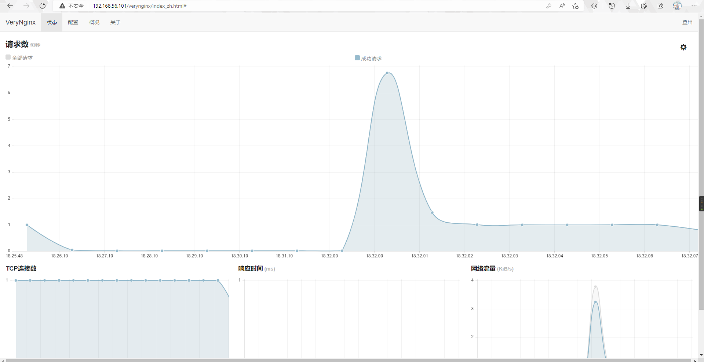

在VeryNginx的`配置>基础>匹配规则`中添加Wordpress和DVWA的域名访问匹配以及直连IP匹配规则，下图所示：

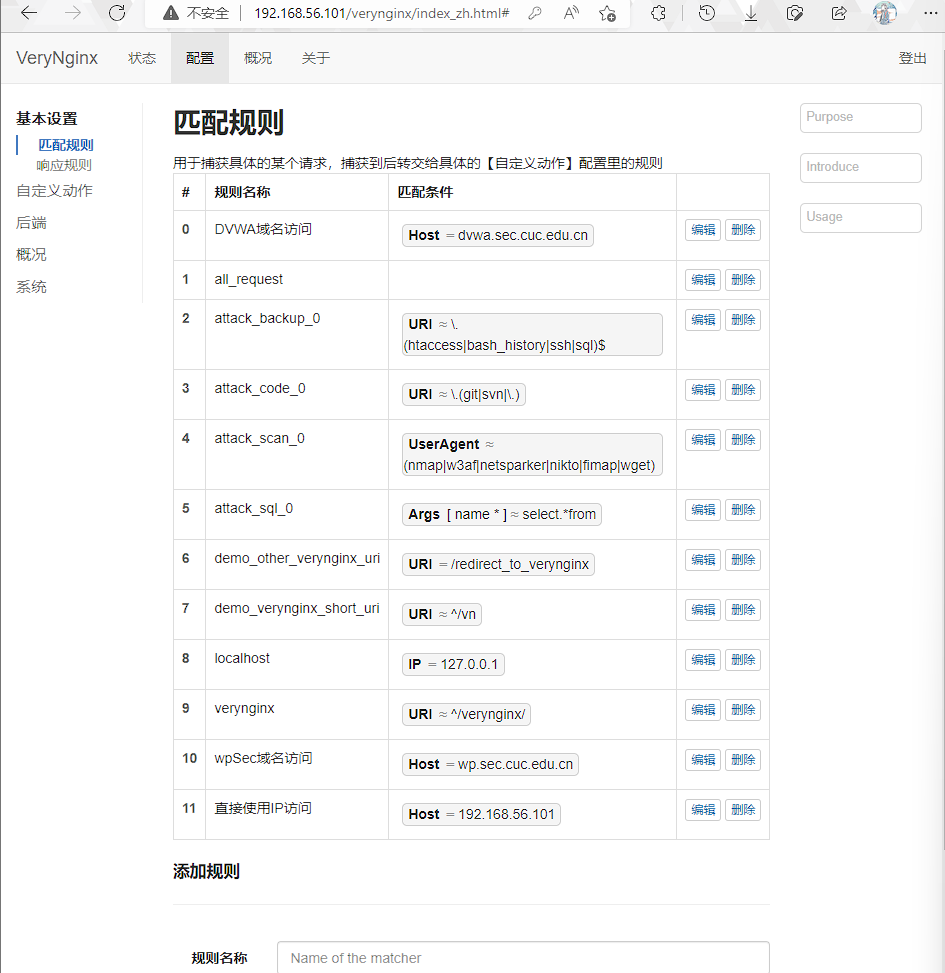

保存配置后在`配置>后端>反向代理`分别添加Wordpress和DVWA的upstream，分别指向localhost:8888和localhost:888，然后使用前面的Matcher分别添加Wordpress和DVWA的Location条件，下图所示：

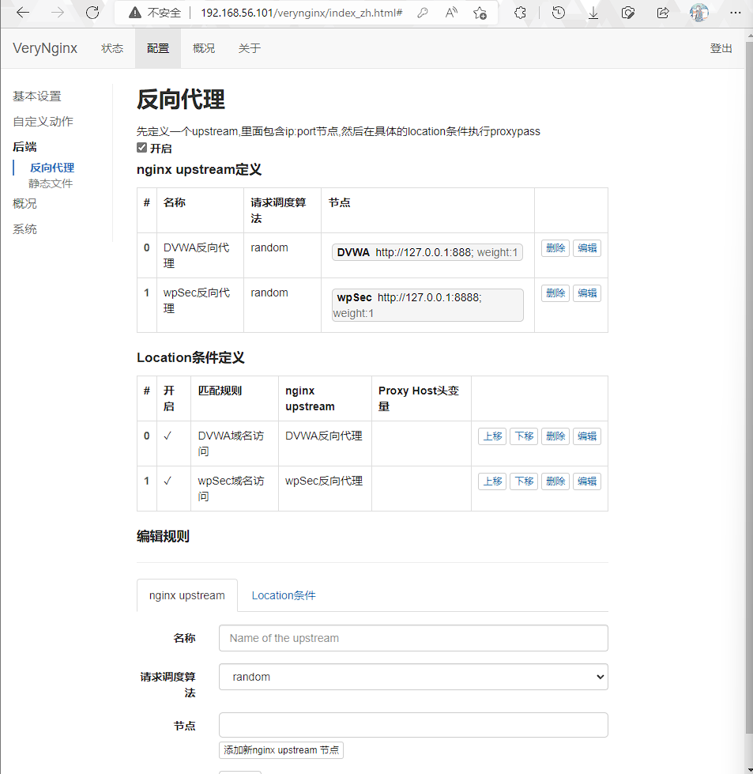

保存配置后在宿主机上配置hosts文件，将wp.sec.cuc.edu.cn、dvwa.sec.cuc.edu.cn与虚拟机IP即192.168.56.101进行对应，下图所示：

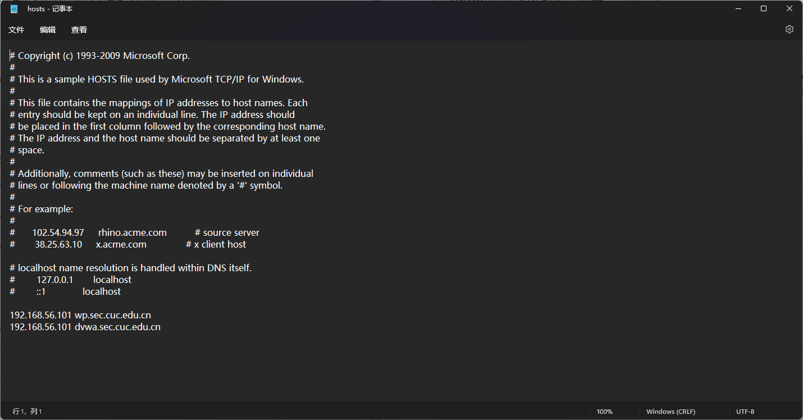

然后就可以在宿主机浏览器分别通过<http://wp.sec.cuc.edu.cn>和<hthttp://dvwa.sesc.cuc.edu.cn>分别访问到Wordpress和DVWA站点，下图所示：


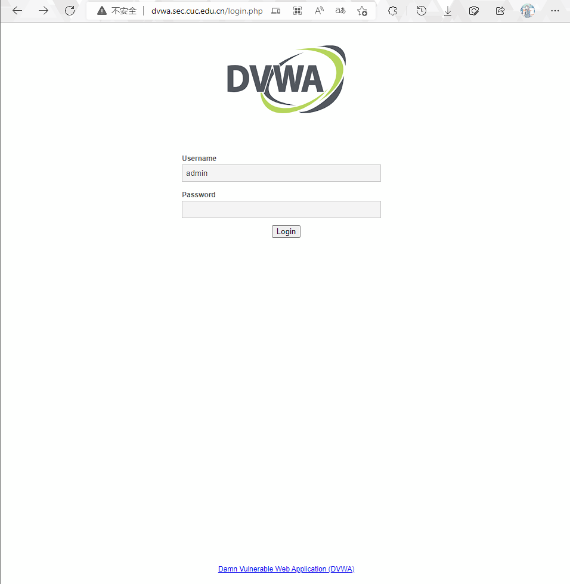

### 安全加固要求搭建

一些前期准备，比如安装apache2-utils用于测试访问频率限制：

```bash
sudo apt install apache2-utils
```

向hosts内添加新的VeryNginx专属域名vn.cf对应192.168.56.101，以防限制IP直接访问后无法访问VeryNginx控制面板。

#### block直接使用IP访问

向hosts内添加新的VeryNginx专属域名vn.cf对应192.168.56.101，以防限制IP直接访问后无法访问VeryNginx控制面板。

在VeryNginx管理页面中的`配置>基本设置>相应规则`中分别创建即将使用的4种“友好”错误信息提示页面，下图所示：

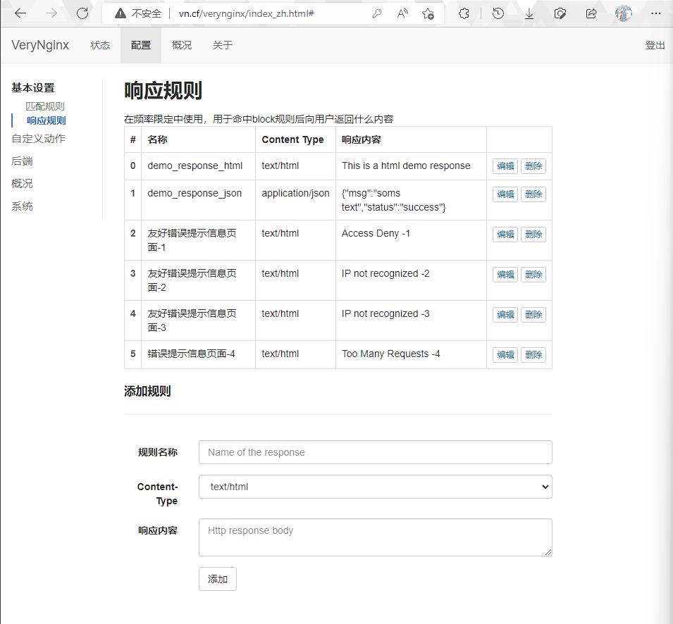

再利用前面添加的直连IP匹配规则，在`配置>自定义动作>拦截规则`中添加block“直接使用IP访问”的匹配规则，下图所示：

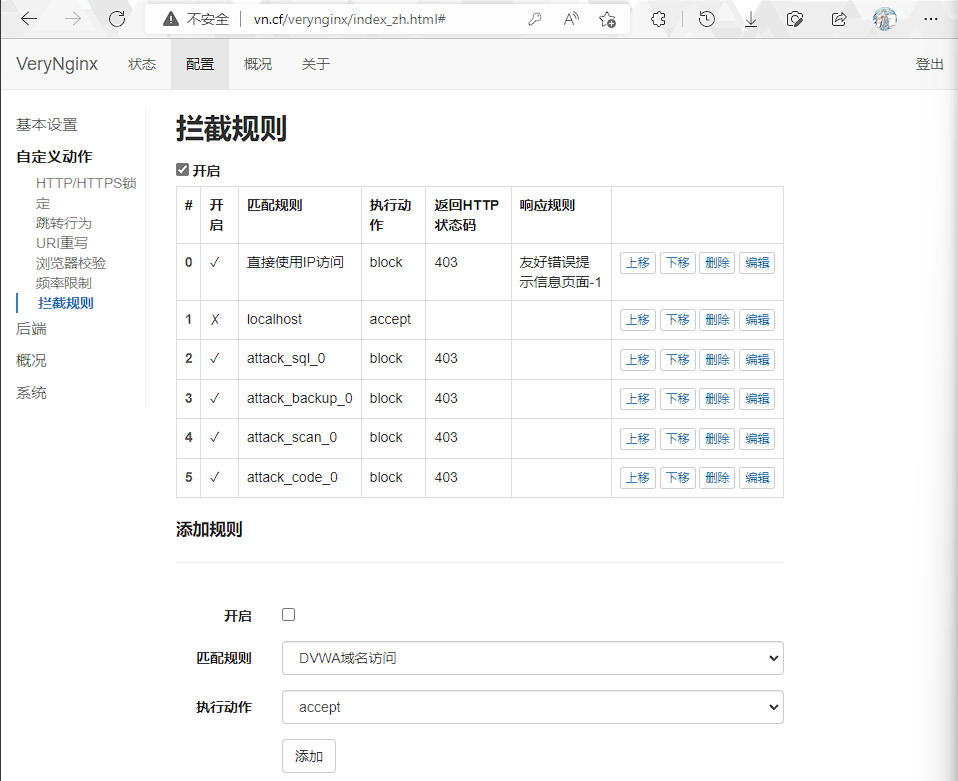

保存配置，新建标签页输入192.168.56.101进行测试，结果下图所示：

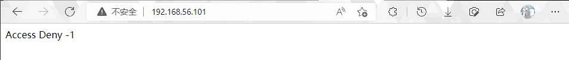

#### DVWA白名单访问

在VeryNginx控制面板的`配置>基本设置>匹配规则`中新建DVWA白名单访问的Matcher(其实是黑名单逻辑实现，192.168.56.254是我专门静态分配了固定的IP)，下图所示：

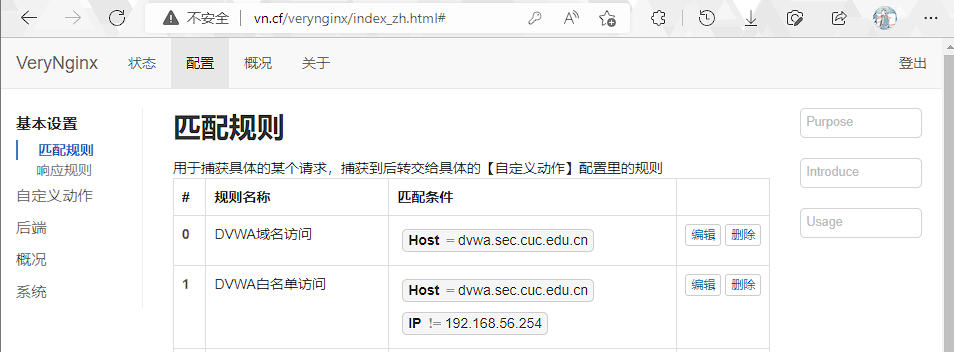

然后在`配置>自定义动作>拦截规则`中添加对DVWA“白”名单的block实现仅限192.168.56.254访问，下图所示：

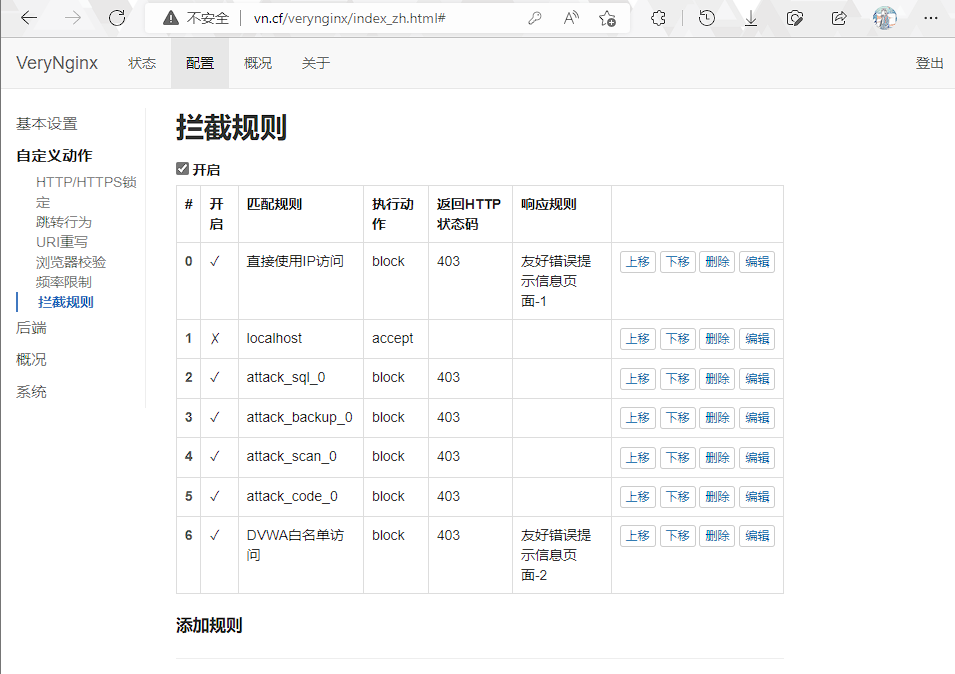

查看宿主机IP地址：

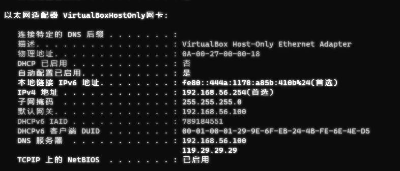

使用当前192.168.56.254进行访问，顺利访问DVWA并进行一波登录：

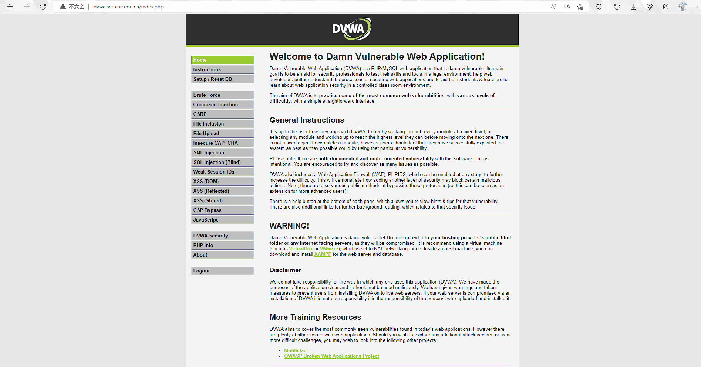

修改宿主机IP，仍然是静态分配192.168.56.253：

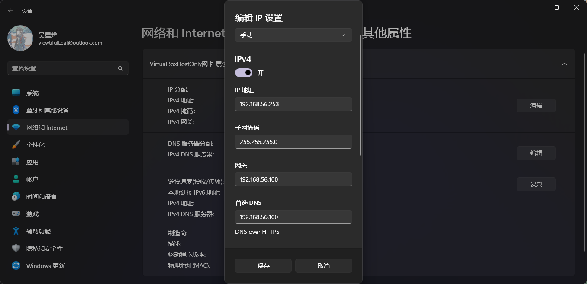

再次进行访问：

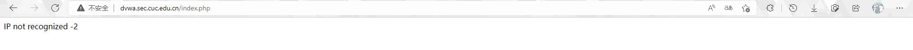

### VeryNginx配置

#### VeryNginx白名单访问

和DVWA思路相同，首先在`配置>基本设置>匹配规则`中添加VeryNginx的白名单访问，同样是以黑名单逻辑实现白名单访问：

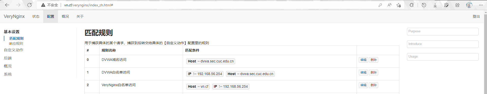

然后再在`配置>自定义动作>拦截规则`中添加对VeryNginx白名单访问的block：

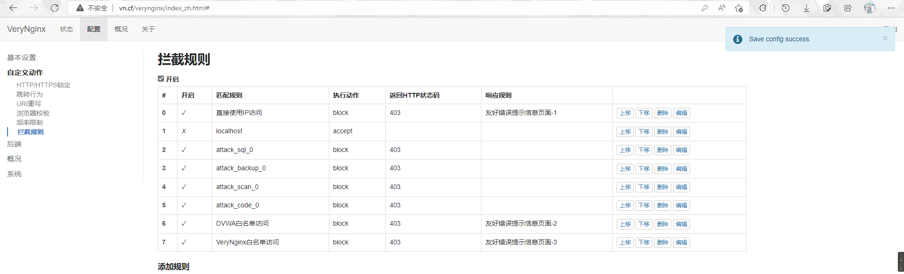

保存后此时进行访问是没有问题的(当前IP为192.168.56.254)，同理修改成192.168.56.253后再次访问有：

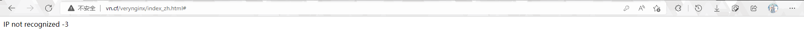

#### 访问频率限制

在`配置>自定义动作>频率限制`中按照最先添加的域名Matcher匹配添加按IP与URI匹配的访问频率限制：

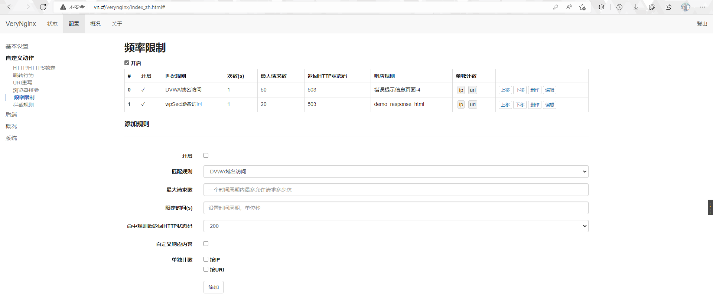

使用`ab -n 100 -c 1 http://wp.sec.cuc.edu.cn`，结果如下：

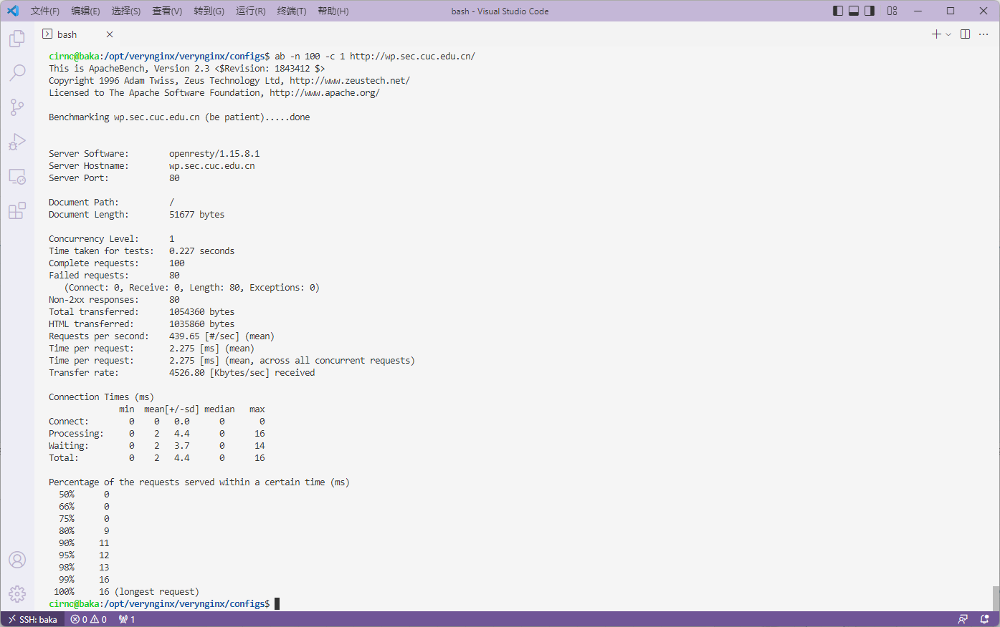

DVWA的频率限制因设置了仅宿主机192.168.56.254可实现访问，测试过程出现100%访问成功率其实为“友好错误提示信息页面-2”，另外没有找到合适的办法在浏览器给到频率>50访问/秒的情况，没能截图到“错误提示信息页面-4”

## 总结与整理

遇到的问题或者踩的坑就在这里总结吧。

### 一些趣事

なし。

いいえ、全然なし。

### 一些踩坑

- 配置PHP-FPM时提示缺少zlib(没记错的话)，Google了一下Ubuntu安装zlib，按照it'sFoss的[这个帖子](https://itsfoss.com/install-zlib-ubuntu/)操作，解决了问题。

- 卸载mysql-server安装mariadb-server遇到了因为没有彻底结束mysqld进程导致卸载与重装都不完全，使用systemctl尝试启动mariadb.service卡在activating，具体情况和serverfault上的[这篇帖子](https://serverfault.com/questions/1013128/mariadb-service-start-stuck-at-activating)过于重合，解决办法也是按照帖子下面唯一也是被采纳的高赞的回答进行处理，完美解决了问题，只是个人来说搞不明白原帖操作的具体理由，云里雾里，帖子回答截图如下，虽然上面贴了链接，下面参考链接也有😶：

    

## 参考链接

- [How to install WordPress](https://wordpress.org/support/article/how-to-install-wordpress/)

- [DVWA README](https://github.com/digininja/DVWA/blob/master/README.zh.md)

- [VeryNginx Wkik](https://github.com/alexazhou/VeryNginx/wiki/%E7%9B%AE%E5%BD%95)

- [mariadb.service start stuck at activating](https://serverfault.com/questions/1013128/mariadb-service-start-stuck-at-activating)

- [How to Install Zlib on Ubuntu Linux](https://itsfoss.com/install-zlib-ubuntu/)

- [Nginx Beginner’s Guide](http://nginx.org/en/docs/beginners_guide.html#control)
